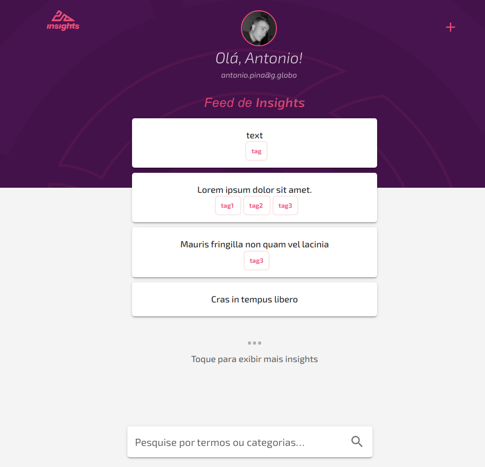
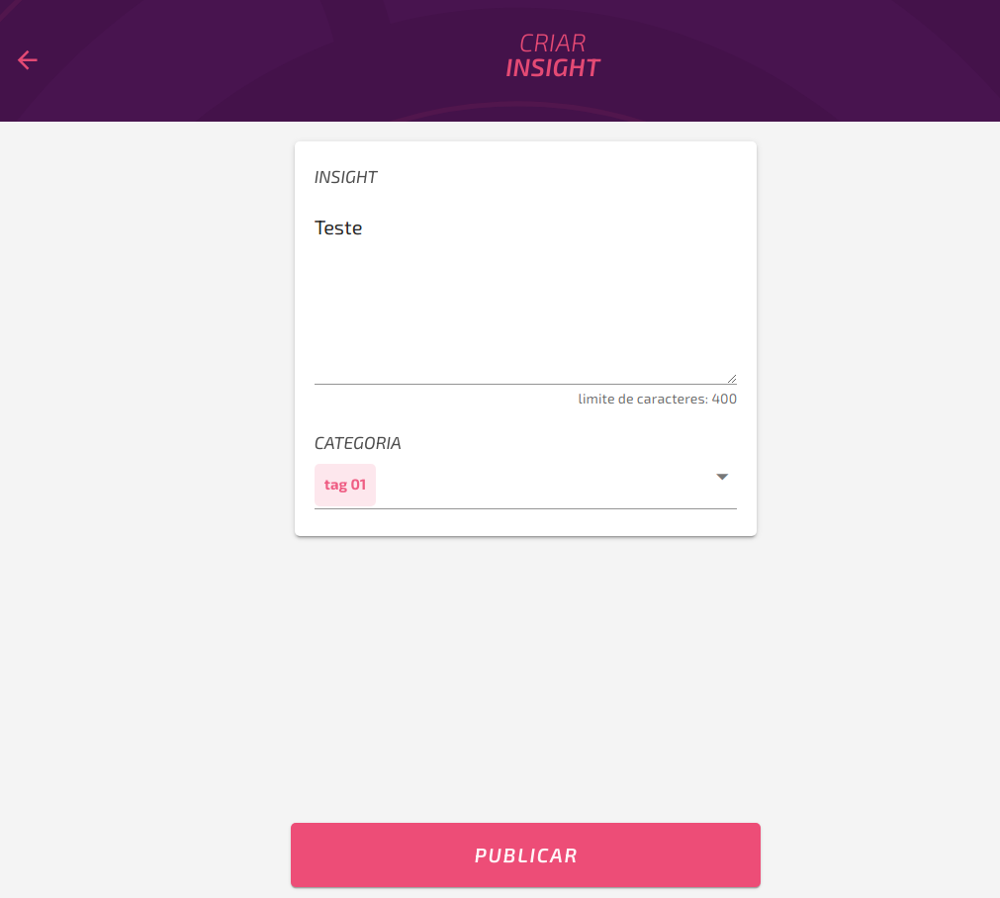

<h1 align="center">
  Insights
</h1>

<h4 align="center"> 
	🚧  Concluído ✅ 🚧
</h4>

<p align="center">
 <a href="#-sobre-o-projeto">Sobre</a>&nbsp;&nbsp;&nbsp;|&nbsp;&nbsp;&nbsp;
 <a href="#wrench-funcionalidades">Funcionalidades</a>&nbsp;&nbsp;&nbsp;|&nbsp;&nbsp;&nbsp;
 <a href="#-layout">Layout</a>&nbsp;&nbsp;&nbsp;|&nbsp;&nbsp;&nbsp;
 <a href="#-como-executar-o-projeto">Como executar</a>&nbsp;&nbsp;&nbsp;|&nbsp;&nbsp;&nbsp;
 <a href="#-tecnologias">Tecnologias</a>&nbsp;&nbsp;&nbsp;|&nbsp;&nbsp;&nbsp;
 <a href="#autor">Autor</a>&nbsp;&nbsp;&nbsp;|&nbsp;&nbsp;&nbsp;
 <a href="#memo-licença">Licença</a>
</p>

##  💻 Sobre o projeto

:bar_chart: Ferramenta para criação de Cards de conteúdo esportivos (Insights)

---
## :wrench: Funcionalidades

- Cards - é possível:
    - [x] Criar card
    - [x] Ler card
    - [x] Remover card
    - [x] Atualizar card
    - [x] Listar cards
      - [x] Filtrar por tags

- Tags - é possível:
    - [x] Criar tag
    - [x] Ler tag
    - [x] Remover tag
    - [x] Atualizar tag
- CLI para importação dos cards
  - Vc pode cards a partir de um csv
  - CSV exemplo:

    ```
    text,tag
    Lorem ipsum dolor sit amet., tag1;tag2;tag3
    Mauris fringilla non quam vel lacinia,tag3
    Cras in tempus libero,
    ```
---

## 🎨 Layout

<p align="center" style="display: flex; align-items: flex-start; justify-content: center;">
  
  
</p>

---


## 🚀 Como executar o projeto

Este projeto é divido em duas partes:
1. Backend (pasta server) 
2. Frontend (pasta web)

💡O Frontend precisa que o Backend esteja sendo executado para funcionar.

### Pré-requisitos

Antes de começar, é preciso ter instalado em sua máquina as seguintes ferramentas:
[Git](https://git-scm.com). [Node.js](https://nodejs.org/en/). [Mysql](https://www.mysql.com/). [npm](https://www.npmjs.com/) ou [yarn](https://yarnpkg.com/).

>Obs: Git é opcional, pois vc pode fazer o download do ZIP

### Primeiro Passo

```bash

# Clone este repositório
$ git clone https://github.com/JonasCastro/insights-thera.git

# Acesse a pasta do projeto no terminal/cmd
$ cd insights-thera

```

#### 🎲 Executando o Backend (servidor)
>Obs: utilize npm ou yarn

Para o correto funcionamento cria o arquivo .env na raiz do projeto
com as informações para acessar a base de dados
> se preferir, pode executar `docker-compose up -d`. Isso vai criar/iniciar os contêineres relacionados ao db (mysql)

Ex:
```
  # DB
  MYSQL_CONNECTION=mysql
  MYSQL_HOST=localhost
  MYSQL_USERNAME=root
  MYSQL_DATABASE=insightsthera
  MYSQL_PORT=3306
  MYSQL_ROOT_PASSWORD=1234

```
```bash

# Vá para a pasta server
$ cd server

# Instale as dependências
$ yarn
$ npm i

# Execute a aplicação em modo de desenvolvimento
$ yarn dev:server
$ npm run dev:server

# O servidor inciará na porta:3333


# Você pode executar o seguinte comando para criar alguns tags do db.
$ yarn typeorm migration:run 
$ npm run typeorm migration:run 

```

#### 🎲 Executando CLI para importação dos card

```bash
# Basta executar 
 python main.py file_exemple.csv

 # "file_exemple.csv" é o nome do arquivo que deve ser importado
```

#### 🧭 Rodando a aplicação web
>Obs: utilize npm ou yarn
```bash

# Vá para a pasta da aplicação Front End
$ cd front

# Instale as dependências
$ yarn
$ npm i

# Execute a aplicação em modo de desenvolvimento
$ yarn dev:server
$ npm run dev:server

```

## 🛠 Tecnologias

As seguintes ferramentas foram usadas na construção do projeto:

#### **Website**  ([Vue](https://vuejs.org/))

-   **[vuetifyjs](https://vuetifyjs.com/en/)**
-   **[Vue Router](https://router.vuejs.org/)**
-   **[Axios](https://github.com/axios/axios)**

> Veja o arquivo  [package.json](https://github.com/JonasCastro/insights-thera/blob/master/front/package.json)

#### **Server**  ([NodeJS](https://nodejs.org/en/)  +  [TypeScript](https://www.typescriptlang.org/))

-   **[Express](https://expressjs.com/)**
-   **[CORS](https://expressjs.com/en/resources/middleware/cors.html)**
-   **[Typeorm](https://typeorm.io/#/insert-query-builder)**
-   **[Mysql](https://www.mysql.com/)**
-   **[ts-node](https://github.com/TypeStrong/ts-node)**
-   **[Docker compose](https://docs.docker.com/compose/)**
-   **[ExpressAsyncErrors](https://www.npmjs.com/package/express-async-errors)**
-   **[Tsyringe](https://github.com/microsoft/tsyringe)**


> Veja o arquivo  [package.json](https://github.com/jonasCastro/insights-thera/blob/master/server/package.json)

#### [](https://github.com/jonascastro/insights-thera#utilit%C3%A1rios)**Utilitários**


-   Editor:  **[Visual Studio Code](https://code.visualstudio.com/)**  → Extensions:  **[ESlintJS](https://marketplace.visualstudio.com/items?itemName=dbaeumer.vscode-eslint)**, **[EditorConfig](https://marketplace.visualstudio.com/items?itemName=EditorConfig.EditorConfig)**
-   Markdown:  **[StackEdit](https://stackedit.io/)**,  **[Markdown Emoji](https://gist.github.com/rxaviers/7360908)**
-   README Template:  **[README-ecoleta](https://github.com/tgmarinho/README-ecoleta/blob/master/README.md)**
-   Teste de API:  **[Insomnia](https://insomnia.rest/)**


---


## Autor

Jonas Castro

[](https://www.linkedin.com/in/jonas-castro-b4044111a/) 

[](mailto:jonascastro128@gmail.com)

---

## :memo: Licença

Este projeto esta sobe a licença [MIT](./LICENSE).

---
Feito com :blue_heart: por Jonas Castro :wave: [Entre em contato!](https://www.linkedin.com/in/jonas-castro-b4044111a/)
